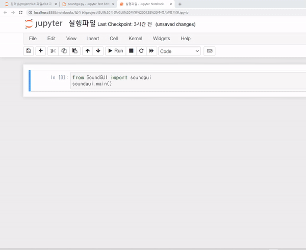
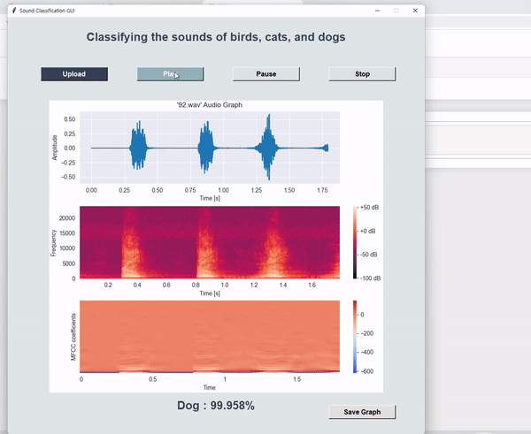

# [DL] Classifying the Sounds of Dogs Cats and Birds

### 1. 프로젝트 설명 
- [프로젝트 PPT](https://github.com/54data/Classifying-the-Sounds-of-Dogs-Cats-and-Birds/blob/main/%5BPPT%5D%20%EA%B0%9C%2C%20%EA%B3%A0%EC%96%91%EC%9D%B4%2C%20%EC%83%88%20%EC%9D%8C%EC%84%B1%20%EB%B6%84%EB%A5%98%ED%95%98%EA%B8%B0.pdf)
- 개, 고양이, 새의 음성 데이터를 통하여 음성을 분류하는 인공신경망 모델을 구축한다.  
- 인공신경망 모델을 기반으로 GUI를 구성해 사용자가 직접 음성을 넣어 테스트할 수 있도록 설계한다.
- **:point_right:담당 포지션 : 인공신경망 모델 기반 GUI 구현**  

### 2. 데이터 수집 및 정제  
- 총 1084개
- 개, 고양이, 새 음성 데이터를 수집하여 각각 훈련 데이터 324개, 테스트 데이터 36개로 나누고, 이후에 고양이 음성 분류 정확도 향상을 위해서 고양이 음성 데이터 4개를 훈련 데이터에 추가하였다.
- **데이터 정제 기준**  
  - 주변 소음이 큰 데이터   
  - 해당 동물 외에 다른 동물의 소리가 겹쳐있는 데이터  
  - 15초 이내의 데이터로만 구성하기 위해 긴 음성 데이터는 잘라서 사용  


### 3. 모델 구현  
3-1) 모델 목표
- 새로운 데이터를 올바르게 분류 분석  
- 테스트 데이터 정확도 90%이상으로 구현하기  
- 오버피팅을 최소화하여 구현하기  

3-2) 최적의 모델 채택 과정
- 위의 목표를 기반으로 최적의 정확도를 가진 인공신경망을 구현하고자 하였고 그 결과 **완전연결계층으로 3층 신경망 모델**을 채택하였다.  
- 모델 채택 과정 중에 고양이 음성 데이터만 오분류하는 문제점이 발생하였고, 이를 해결하기 위하여 아래와 같이 진행하였다.  
    - 훈련/테스트 데이터 비율을 9:1로 수정
    - 테스트 과정 중 틀리게 분류한 4개의 음성 데이터를 훈련 데이터로 추가


### 4. GUI
4-1) GUI 구현 목표  
- 그래프를 통한 시각화 : 진폭 plot / specgram / MFCC  
- Upload, Play, Pause, Stop, Save Graph 5개의 버튼 구현  
- 모델 예측 결과를 % 비율로 표시  
- **패키지를 통한 편의성 확보 (패키지명 : SoundGUI)**


4-2) GUI 시연  
<p align="center"></p>  
</br>

4-3) GUI 주요 기능  

1. **Upload** : 파일 업로드 버튼  
  - 해당 버튼 클릭시 실행되는 함수 : **upload_audio**
  ```
      def upload_audio(self):
        try:    
            path = filedialog.askopenfilename() # 대화상자를 만들고 파일을 선택할 수 있도록 함, 파일 경로가 변수에 담김 
            if path != '':                      # 새로운 경로가 변수에 들어왔다면
                self.file_path = path           # file_path 변수에 경로를 담기
                self.load_audio()
                self.destroy()                  # destroy 함수 호출
                self.cnt_play_event = True
                self.save_button.place_forget() 
        except:
            pass
  ```  
</br>

2. **Play** : 음성 파일 재생 버튼  
  - 해당 버튼 클릭시 실행되는 함수 : **play**
  ```
      def play(self):
        try:
            pygame.mixer.music.play() # 로드한 오디오 파일 재생
        
            # file_path에 그려지는 그래프와 모델 분류는 한번만 하고 유지되도록 함
            if self.cnt_play_event:
                try:
                    self.classify()       # classify 함수 호출
                    self.set_plot()       # set_plot 함수 호출

                    # 그래프 파일 저장 버튼
                    self.save_button = Button(self.root, text='Save Graph', command=self.save_graph, width=15, height=1)
                    self.save_button.configure(background='#E6DFDF', font=('Arial',12,'bold'))
                    self.save_button.place(x=770, y=930)
                except:
                    pass
                finally:
                    self.cnt_play_event = False # play를 누를 때마다 그래프와 예측 결과가 텍스트가 새로 나타나지 않도록 함(겹치지 않게)
        except:
            pass
  ```
  - play 함수 호출시 모델 예측 결과와 그래프가 반환되고, 그래프 파일 저장이 가능한 Save Graph 버튼이 나타난다.

</br>

3. **Pause** : 음성 일시정지 버튼   
  - 해당 버튼 클릭시 실행되는 함수 : **pause**
  ```
      def pause(self):
        if pygame.mixer.music.get_busy(): # 음악이 재생 중인지 확인
            pygame.mixer.music.pause()
        else:
            pygame.mixer.music.unpause()
  ```

</br>

4. **Stop** : 음성 정지 버튼  
  -  해당 버튼 클릭시 실행되는 함수 : **stop**
  ```
      def stop(self):
        try:
            pygame.mixer.music.stop() # 재생중인 오디오 파일을 정지
        except:
            pass
  ```
  
</br>

5. **Save Graph** : 그래프 저장 버튼  
  - 해당 버튼 클릭시 실행되는 함수 : **save_graph**
  <p align="center"></p>
  
  ```
      def save_graph(self):
        try:
            files = [('PNG', '.png'), ('JPEG', '.jpg'), ("All Files", ".*")]  # 저장할 수 있는 파일 형식 목록
            save_file = filedialog.asksaveasfilename(initialdir="/", 
                                                     title="Select Folder", 
                                                     filetypes=files,
                                                     defaultextension='.png')
            if save_file:
                self.f.savefig(save_file) 
                messagebox.showinfo("Success!", "Save pictures successfully") # 파일이 저장될 때만 알림창이 나타나도록 함
        except:
            pass
  ```
  
</br>

4-4) GUI 문제 해결리스트  
>GUI에서 음성을 Play하는 중에 창을 닫아도 계속 Play 되는 문제  
  - 해결방법 : 창을 닫으면 재생중인 음성 파일이 정지되는 함수 구현 
  - **__init__** 함수에 아래의 부분을 넣는다.  
  ```
  # tkinter 창을 닫으면 음악이 재생되지 않도록 함
  self.root.protocol("WM_DELETE_WINDOW", self.on_closing)
  ```
  - tkinter 창을 닫으면 **on_closing**함수가 실행되도록 한다.  
  ```
    # tkinter 창을 닫으면 실행되는 함수, 창을 닫으면 재생중인 음악이 정지
    def on_closing(self):
        pygame.mixer.music.stop()
        pygame.mixer.quit()
        self.root.destroy()
  ```  
</br>

>특정 파일 로드시 **Unknown WAVE format** 에러 발생  
  - 발생원인 : "32-bit floating point WAV File" pygame으로 32비트 부동 소수점 값을 포함하는 오디오 WAV 파일을 읽을 수 없다.  
  - 해결방법 : soundfile 모듈을 사용하여 16비트 wav 파일로 변환하여 pygame으로 로드한다.  
  - **load_audio** 함수 안에 아래의 부분을 넣는다.
  ```
  soundfile.write(self.file_path, data, samplerate, subtype='PCM_16') # wav 파일을 읽을 수 있도록 변환
  ```
</br>
